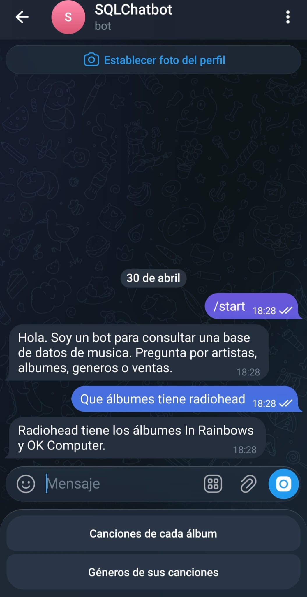
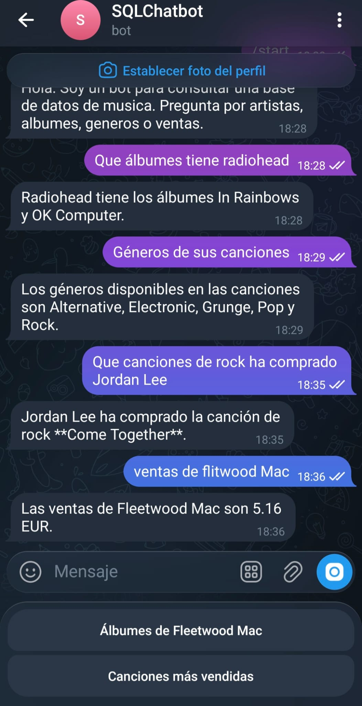
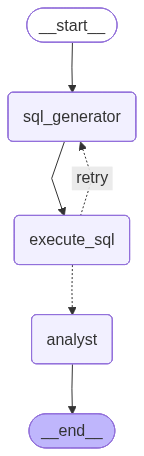
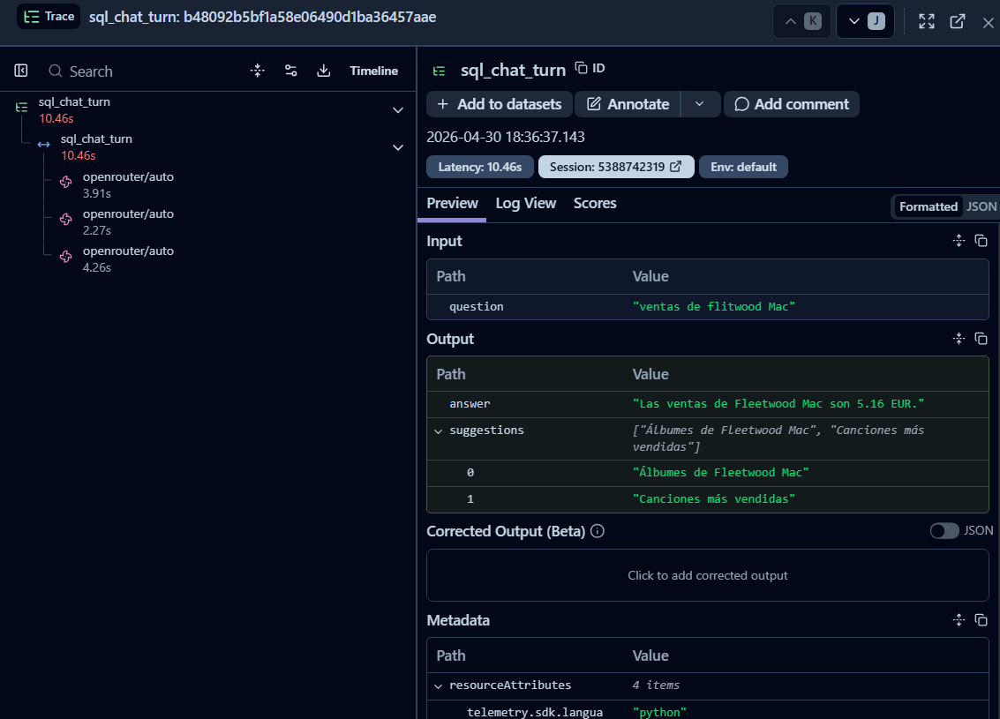

# SQL Music Chatbot 🎵🤖

**SQL Music Chatbot** es un asistente conversacional para bases de datos SQLite orientado a consultas musicales. Está diseñado para convertir lenguaje natural a SQL robusto, ejecutar consultas con seguridad y devolver explicaciones claras en un flujo **multiactor con LangGraph**. El objetivo principal es **resolver problemas reales de ingeniería de IA**: errores ortográficos, ambigüedades, consultas complejas y trazabilidad end-to-end.

---

## ✨ Highlights
- **Arquitectura de agentes** con tres nodos clave y un grafo de estados con autocorrección.
- **Manejo inteligente de datos**: fuzzy matching y validación de existencia con lógica SQL.
- **Telegram como frontend** con **Inline Keyboards** para sugerencias contextuales.
- **Observabilidad** con Langfuse para auditoría de SQL, trazas y latencia.

---

## 🧠 Arquitectura de Agentes (LangGraph)
El bot usa LangGraph para orquestar un grafo de estados con tres nodos principales:

| Nodo | Responsabilidad | Entradas | Salidas |
| --- | --- | --- | --- |
| `sql_generator` | Traduce lenguaje natural a SQL robusto usando `LOWER` y `LIKE` | Pregunta del usuario + esquema | SQL seguro y explicable |
| `execute_sql` | Ejecuta SQL contra SQLite y captura errores | SQL | Resultado o error |
| `analyst` | Interpreta resultados, explica y gestiona errores o sugerencias | Resultado + errores | Respuesta final + sugerencias |

**Flujo resumido:**
1. Usuario pregunta en Telegram.
2. `sql_generator` crea la consulta SQL.
3. `execute_sql` valida y ejecuta.
4. `analyst` interpreta, explica y sugiere.

---

## 🧪 Manejo Inteligente de Datos (clave del proyecto)

### ✅ Fuzzy Matching (tolerancia a errores ortográficos)
El bot entiende errores de escritura aplicando lógica SQL con `LOWER` y `LIKE`, más una capa de razonamiento en `analyst` para sugerencias. Ejemplo real:

**Entrada:**
```text
Ventas de Nirvna
```

**SQL aproximado (simplificado):**
```sql
SELECT artist_name
FROM artists
WHERE LOWER(artist_name) LIKE '%nirvna%'
```

**Salida esperada:**
```text
No encontré "Nirvna". ¿Quizás quisiste decir "Nirvana"?
```

> 💡 El analista combina coincidencias parciales con contexto de la pregunta para proponer correcciones útiles.

### ✅ Validación de existencia (0 vs No hay registros)
No es lo mismo que un artista exista pero tenga **0 ventas**, a que **no exista en la DB**. Implementamos una lógica de doble verificación cruzando resultados SQL con metadatos de tablas para evitar falsos negativos (por ejemplo, "Bad Bunny"):

| Caso | Resultado | Interpretación |
| --- | --- | --- |
| Artista existe + ventas = 0 | `0` | El artista existe pero no tiene ventas registradas |
| Artista no existe | `No hay registros` | No hay coincidencias en la base |

**Estrategia:**
1. Consulta de existencia del artista (por nombre normalizado).
2. Verificación con metadatos de tablas relevantes para confirmar presencia.
3. Consulta de ventas si existe.
4. El `analyst` decide el mensaje final y evita falsas negativas.

---

## 💬 Interfaz y UX

- **Telegram** como frontend conversacional.
- **Inline Keyboards** para sugerencias dinámicas y desambiguación.
- Respuestas diseñadas para ser **interpretables** y **orientadas a decisiones**.

Ejemplo de teclado:
```text
¿Te refieres a?
[ Nirvana ]  [ Nirvana (Unplugged) ]  [ Nirvana (Remastered) ]
```

---

## 🧩 Portabilidad (Schema-Agnostic)
El diseño es **schema-agnostic**. El bot extrae el DDL dinámicamente desde SQLite, por lo que `sql_generator` se adapta a cualquier esquema con cambios mínimos en el prompt del sistema. Esto permite migrar entre bases SQLite sin reescribir la lógica del grafo.

## 🔭 Observabilidad
La integración con **Langfuse** permite:

- 📌 Trazado completo del flujo de agentes.
- 🧾 Auditoría de SQL generado.
- ⏱️ Monitoreo de latencia y costos por consulta.
- 🧪 Debugging post-mortem con trazas por usuario.

---

## 🖼️ Recursos visuales
<p align="center"></p>
Interaccion en Telegram (Demo) - 1

<p align="center"></p>
Interaccion en Telegram (Demo) - 2

<p align="center"></p>
Visualizacion del Grafo de Estados (LangGraph)

<p align="center"></p>
Traza de observabilidad (Langfuse)

## 🧾 Ejemplos de consultas

### Nivel simple
```text
¿Qué álbumes tiene Radiohead?
```

### Nivel complejo (JOINs)
```text
¿Qué canciones de Rock ha comprado Jordan Lee?
```

### Gestión de errores (fuzzy matching)
```text
Ventas de Flitwood Mac
```

---

## ⚙️ Guía de instalación

### 1) Crear entorno virtual
```powershell
python -m venv .venv
.\.venv\Scripts\Activate.ps1
```

### 2) Instalar dependencias
```powershell
pip install -r requirements.txt
```

### 3) Configurar variables de entorno
Crea un archivo `.env` con las siguientes variables:

```env
TELEGRAM_BOT_TOKEN=your_telegram_token
OPENROUTER_API_KEY=your_openrouter_key
LANGFUSE_PUBLIC_KEY=your_langfuse_public_key
LANGFUSE_SECRET_KEY=your_langfuse_secret_key
LANGFUSE_HOST=https://cloud.langfuse.com
```

### 4) Ejecutar el bot
```powershell
python -m src.bot
```

---

## 📁 Estructura del proyecto
```text
main.py
src/
	agents.py
	bot.py
	graph.py
	init_db.py
	tools.py
data/
	music.db
requirements.txt
```

---

## ✅ Estado del proyecto
Proyecto funcional con foco en **robustez**, **observabilidad** y **UX conversacional**. Los mayores retos resueltos incluyen:

- Manejo de errores ortográficos sin degradar precisión.
- Detección correcta de inexistencia vs ausencia de ventas.
- Auditoría completa de SQL y latencia con Langfuse.
- Ejecución inmediata gracias a `data/music.db` incluido en el repo tras configurar las API Keys.

---

## 👤 Autor
- **Nombre:** David Murguialday Osés
- **Curso:** Generative AI for Software Engineering
- **Profesor:** @juananpe

---

*Desarrollado con GitHub Copilot como asistente principal.*